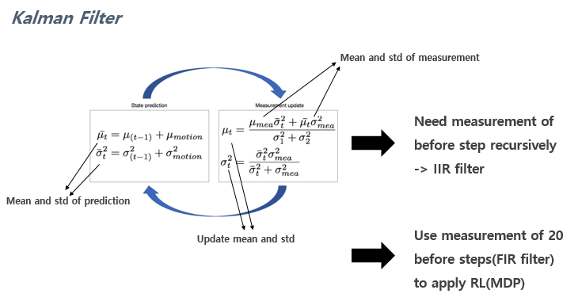
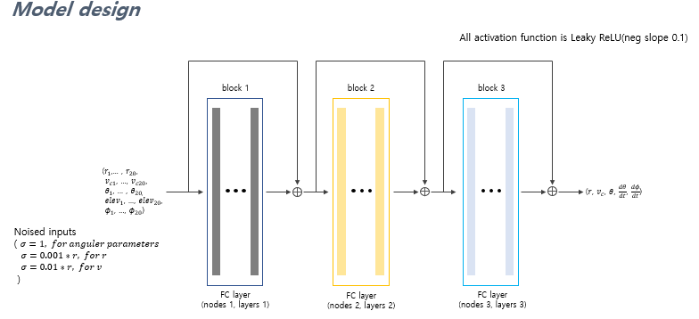
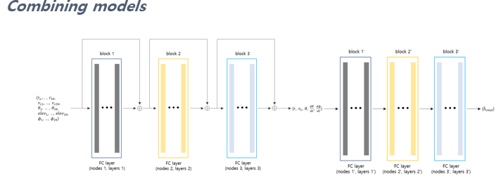
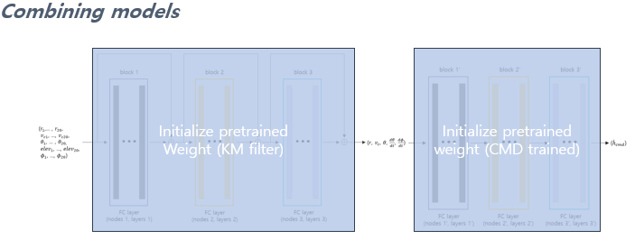
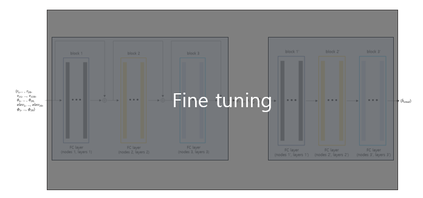

# Kalman_Filter_Modeling
본 Repo는 기존에 레이더 정보를 기반으로 학습시켰던 네트워크의 밑단에, 좀 더 raw data 영역인 노이즈가 낀 일련의 데이터들을 필터링 하는 네트워크를 추가하는 것을 목적으로 한다. 이전까지의 학습 내용은 [Model_Optimization_Using_DPPO](https://github.com/kun-woo-park/Model_Optimization_Using_DPPO) 에서 확인할 수 있다.

# Kanman Filter

# Model design

# Model combine

# Combining models and fine tuning

